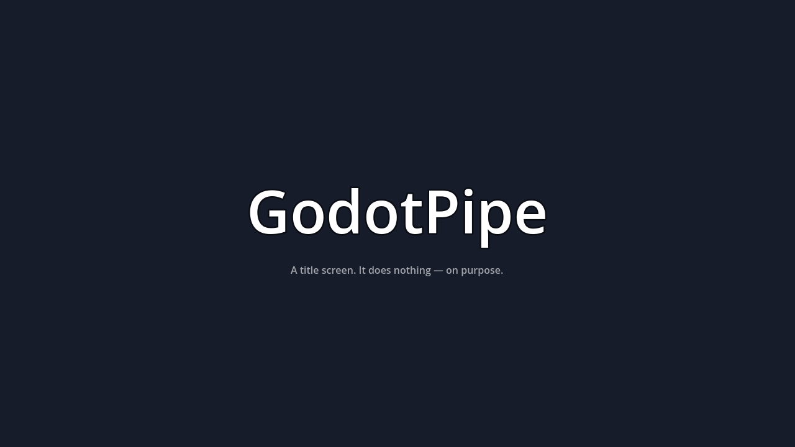

# GodotPipe

A deliberately minimal **Godot 4 game**: it launches, shows a title screen, and
does nothing else. This repo also wires the project up to the **Godot engine**
and the **[godot-mcp](https://github.com/Coding-Solo/godot-mcp)** server so the
engine can be driven programmatically (by Claude/any MCP client).



*(The image above was rendered headlessly by the engine itself — see
[Proof it renders](#4-proof-it-actually-renders-no-gpu-needed).)*

---

## TL;DR for a C++ programmer

Godot is not a library you link against and call from `main()`. It is a
**precompiled engine executable** that loads your game as **data**:

| You might expect (native/C++)        | Godot's actual model                                   |
| ------------------------------------ | ------------------------------------------------------ |
| Compile your code into an executable | The **engine binary is already compiled**; you ship data |
| `int main()` entry point             | `run/main_scene` in `project.godot` — a file path        |
| Object graph built in code           | A **`.tscn` scene**: a serialized, declarative node tree |
| Header/build config (CMake)          | `project.godot` — a plain INI manifest                   |
| Logic in `.cpp`                      | Optional `.gd`/C# scripts attached to nodes (**none here**) |

Because this game only needs to *show* something, it contains **zero gameplay
code**. The title screen is pure declarative data; the engine deserializes it
into live `Control` UI nodes and draws one frame. That is the whole program.

---

## What's in the repo

```
godotpipe/
├── project.godot              # the manifest: name, entry scene, window, renderer
├── icon.svg                   # app/window icon
├── icon.svg.import            # engine-generated import metadata (committed on purpose)
├── scenes/
│   └── title_screen.tscn      # THE GAME: a declarative Control node tree, no script
├── tools/                     # verification only — NOT part of the shipped game
│   ├── capture.tscn           #   tiny scene that loads the title screen…
│   └── capture.gd             #   …draws a few frames, screenshots, and quits
├── docs/
│   ├── .gdignore              # tells Godot "don't import this folder as assets"
│   └── title_screen.png       # the captured proof-of-render
├── scripts/
│   ├── setup_godot.sh         # download + install the engine (from GitHub Releases)
│   ├── setup_mcp.sh           # clone + build the godot-mcp server from source
│   ├── run.sh                 # launch the game (desktop, or HEADLESS=1 for servers)
│   └── capture.sh             # regenerate docs/title_screen.png headlessly
├── .mcp.json                  # MCP client config → godot-mcp → the engine
└── .gitignore                 # ignores .godot/ cache, exports, etc.
```

> The engine binary (~139 MB) and the godot-mcp server live **outside** the repo
> under `/home/user/tools/` and are (re)created by the `scripts/setup_*.sh`
> scripts — they are intentionally not committed.

---

## How this was built, step by step

### 1. Install the engine
Godot ships as one self-contained binary. The environment's network policy
allows **GitHub** but blocks `godotengine.org`, so the binary is pulled from
**GitHub Releases**:

```bash
./scripts/setup_godot.sh           # → /home/user/tools/godot/godot
/home/user/tools/godot/godot --headless --version
# 4.6.3.stable.official.7d41c59c4
```

### 2. Author the game as data
- `project.godot` declares the app name, the **entry scene**
  (`run/main_scene="res://scenes/title_screen.tscn"`), the 1280×720 window, and
  the renderer.
- `scenes/title_screen.tscn` is a hand-written, fully-commented scene. Node tree:

  ```
  TitleScreen (Control)        ← fills the viewport
  ├── Background (ColorRect)    ← solid dark fill
  └── Center (CenterContainer)  ← centers its child
      └── Lines (VBoxContainer) ← stacks two labels
          ├── Title    (Label)  "GodotPipe"
          └── Subtitle (Label)  "A title screen. It does nothing — on purpose."
  ```

  `res://` is the project root; the `.tscn` text format is the canonical,
  diff-friendly representation the editor reads and writes.

### 3. Let the engine validate it
```bash
/home/user/tools/godot/godot --headless --path . --import
```
This scans the project, imports `icon.svg` (producing `icon.svg.import`), and
builds the `.godot/` cache. A clean exit means the scene parsed correctly.

### 4. Proof it actually renders (no GPU needed)
The container has no GPU, so we render with **Mesa llvmpipe** (software OpenGL)
inside a virtual X server (**Xvfb**). `tools/capture.gd` instances the real
title screen, waits for the renderer to draw, reads the framebuffer back, and
saves a PNG:

```bash
./scripts/capture.sh        # → docs/title_screen.png (1280×720)
```

Engine log excerpt during capture:
```
OpenGL API 4.5 (Core Profile) Mesa 25.2.8 - Compatibility - Using Device: llvmpipe
CAPTURE_RESULT err=0 size=(1280, 720) path=/home/user/godotpipe/docs/title_screen.png
```

### 5. Wire up godot-mcp (drive the engine via MCP)
`godot-mcp` is a small Node server that exposes the engine to an MCP client as
callable tools. Built from source and pointed at our engine:

```bash
./scripts/setup_mcp.sh      # → /home/user/tools/godot-mcp/build/index.js
```

It was smoke-tested over stdio (a real MCP `initialize` → `tools/list` →
`tools/call` handshake). The server advertised **14 tools** and
`get_godot_version` returned `4.6.3.stable.official.7d41c59c4` — i.e. the MCP
server successfully shelled out to the engine binary:

```
launch_editor, run_project, get_debug_output, stop_project, get_godot_version,
list_projects, get_project_info, create_scene, add_node, load_sprite,
export_mesh_library, save_scene, get_uid, update_project_uids
```

---

## Running the game yourself

**Desktop (with a GPU/display):**
```bash
GODOT_PATH=/path/to/godot ./scripts/run.sh      # opens a window with the title screen
```

**Headless server (no display):**
```bash
HEADLESS=1 ./scripts/run.sh                       # Xvfb + software OpenGL
```

Or run the engine directly:
```bash
/home/user/tools/godot/godot --path .             # play
/home/user/tools/godot/godot -e --path .          # open in the editor
```

---

## Using the engine through MCP

`.mcp.json` (read automatically by Claude Code at the repo root) is wired to the
**locally built** server, which is the exact one verified above:

```json
{
  "mcpServers": {
    "godot": {
      "command": "node",
      "args": ["/home/user/tools/godot-mcp/build/index.js"],
      "env": { "GODOT_PATH": "/home/user/tools/godot/godot", "DEBUG": "false" }
    }
  }
}
```

> **Important:** MCP servers are loaded when a Claude Code **session starts**, so
> the `godot` tools become available in the *next* session opened on this repo —
> not the one that created this file. (That's why the setup above was verified by
> driving the server directly over stdio.)

**Portable alternative** (any machine, no build step) — swap the server block for:

```json
"command": "npx",
"args": ["-y", "@coding-solo/godot-mcp"],
"env": { "GODOT_PATH": "/path/to/godot" }
```

On a machine where `godot` is already on `PATH`, `GODOT_PATH` can be omitted —
the server auto-detects the engine. Adjust the absolute paths to match wherever
`scripts/setup_*.sh` installed things.

---

## Environment notes

- **Engine:** Godot `4.6.3.stable` (Linux x86_64), from GitHub Releases.
- **Renderer (headless):** Mesa llvmpipe via `--rendering-driver opengl3
  --rendering-method gl_compatibility` under Xvfb. The committed project default
  is `forward_plus` (Vulkan) for real desktops.
- **MCP server:** `godot-mcp` 0.1.1 (Node 22), built from source.
- **Audio:** the container has no sound card; Godot logs ALSA/PulseAudio
  warnings and falls back to a dummy audio driver. Harmless for this project.
