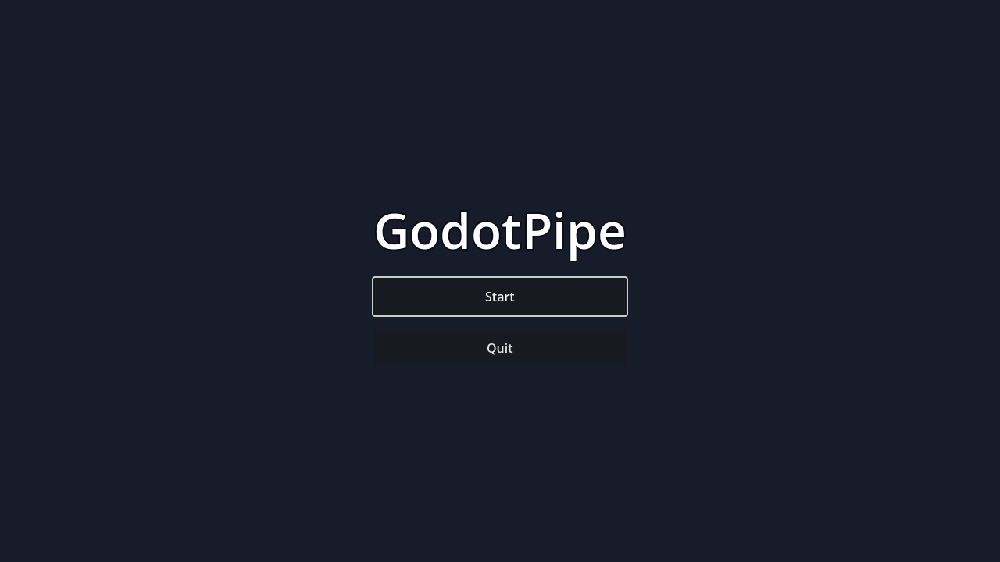
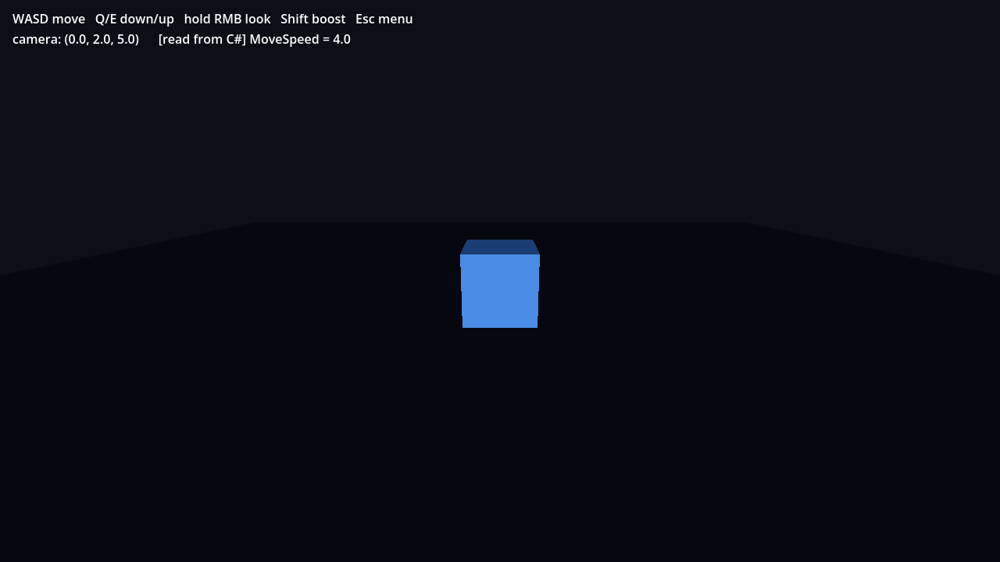

# GodotPipe

A small **Godot 4 (.NET)** project that deliberately mixes **GDScript** and **C#**.
Flow: a title splash → a main menu → a 3D world with a cube you can fly around.
The UI/flow is GDScript; the camera is C#; a GDScript HUD reads live state out of
the C# node — so both languages share one node tree.

| Title | Main menu | 3D world (C# camera + GDScript HUD) |
|---|---|---|
|  |  |  |

*(All three were rendered headlessly by the engine — see [Verification](#verification).)*

---

## Scene flow

```
title_screen.tscn ──any key/click──▶ main_menu.tscn ──"Start"──▶ world.tscn
   (GDScript)                          (GDScript)                 (C# + GDScript)
                                          │
                                       "Quit" ─▶ exit
```
Transitions are one call each: `get_tree().change_scene_to_file(...)` (GDScript) /
`GetTree().ChangeSceneToFile(...)` (C#). In the world, **Esc** returns to the menu.

## Which language does what — and why

| File | Language | Role |
|---|---|---|
| `scripts/title_screen.gd` | GDScript | Splash → advance to menu on any input |
| `scripts/main_menu.gd` | GDScript | Wire `Start`/`Quit` buttons |
| `scripts/world_hud.gd` | GDScript | HUD that **reads the C# camera** each frame |
| `scripts/CameraRig.cs` | **C#** | Free-fly camera: input, vector math, movement |

The split is intentional: GDScript is quick for UI glue; C# gives the camera
controller static typing and the OOP you're used to. They are not isolated —
`world.tscn` contains both a C#-scripted `Camera3D` and a GDScript-scripted
`Label` in the same tree.

### The C# ⇄ GDScript interop, concretely
`CameraRig.cs` exposes a field:
```csharp
[Export] public float MoveSpeed = 4.0f;
```
`world_hud.gd` (GDScript) reads it **by name**, plus the camera's live position:
```gdscript
var p: Vector3 = _camera.global_position      # built-in node property
var speed: Variant = _camera.get("MoveSpeed") # a C# [Export] field, read from GDScript
```
That `[read from C#] MoveSpeed = 4.0` line visible in the world screenshot is
GDScript displaying a value owned by the C# object. The run log also prints both
sides, proving each executed:
```
[C#] CameraRig ready; aimed at cube from (0, 2, 5).
[GD] HUD reading C#-driven camera; start pos = (0.0, 2.0, 5.0)
```

### Controls (in the world)
`WASD` move · `Q`/`E` down/up · hold **right mouse** to look · `Shift` to boost · `Esc` to menu.

---

## Notes for a C++ programmer

Godot is a precompiled **engine executable** that loads your game as **data**
(`.tscn` scenes) plus optional scripts attached to nodes.

| Native / C++ | Godot |
|---|---|
| Compile your code into the executable | Engine binary is prebuilt; you ship scenes + scripts |
| `int main()` | `run/main_scene` in `project.godot` (a file path) |
| Object graph built in code | `.tscn`: a serialized, declarative node tree |
| `.cpp` translation units | `.gd` (interpreted) or **`.cs` (compiled to an assembly)** |
| Header/build config (CMake) | `project.godot` (INI) + `GodotPipe.csproj` (MSBuild) |

The C# here is **not** a native plugin (GDExtension). It's managed .NET: the
`Godot.NET.Sdk` MSBuild SDK compiles `CameraRig.cs` into `GodotPipe.dll`, which
the engine loads at runtime. `partial class CameraRig : Camera3D` works because a
Roslyn source generator emits the glue that registers the class with the engine.

---

## Repo layout

```
godotpipe/
├── project.godot              # manifest; [dotnet] section marks this a C# project
├── GodotPipe.csproj / .sln    # the C# project (compiled by `dotnet build`)
├── icon.svg (+ .import)        # app icon
├── scenes/
│   ├── title_screen.tscn       # GDScript splash (no subtitle)
│   ├── main_menu.tscn          # GDScript menu (Start / Quit)
│   └── world.tscn              # 3D: cube + ground + light, C# camera, GDScript HUD
├── scripts/
│   ├── title_screen.gd         # GDScript
│   ├── main_menu.gd            # GDScript
│   ├── world_hud.gd            # GDScript (reads the C# camera)
│   └── CameraRig.cs            # C#  (the camera controller)
├── tools/
│   ├── capture.tscn / capture.gd   # headless screenshot harness (not the game)
├── docs/                       # committed proof screenshots
├── scripts/setup_godot.sh      # install the standard engine (GDScript-only)
├── scripts/setup_dotnet.sh     # install .NET SDK + the Godot .NET/Mono engine
├── scripts/setup_mcp.sh        # build the godot-mcp server
├── scripts/run.sh              # build C# + launch (HEADLESS=1 for servers)
├── scripts/capture.sh          # regenerate docs/*.png
└── .mcp.json                  # godot-mcp → the Godot .NET engine
```

> The engine binaries (~140 MB each) and the godot-mcp server live **outside** the
> repo under `/home/user/tools/`, installed by the `scripts/setup_*.sh` scripts.
> `.godot/` (incl. the compiled `mono/` output) and `bin/`, `obj/` are git-ignored.

---

## Build & run

This project contains C#, so it needs the **Godot .NET editor/engine** (the
standard build cannot open it) and the **.NET 8 SDK**.

```bash
# one-time setup
./scripts/setup_dotnet.sh        # .NET 8 SDK + Godot .NET/Mono build
./scripts/setup_mcp.sh           # (optional) the godot-mcp server

# build the C# and run
dotnet build GodotPipe.csproj    # → .godot/mono/temp/bin/Debug/GodotPipe.dll
./scripts/run.sh                 # desktop window  (builds C# first)
HEADLESS=1 ./scripts/run.sh      # headless: Xvfb + software OpenGL
```

Opening **in the Godot .NET editor** (which you have): just open `project.godot`.
The editor restores NuGet packages, builds the C#, and you can press Play. The
title appears first; any key → menu; **Start** → the cube world.

---

## Verification

No GPU in the build box, so scenes are rendered with **Mesa llvmpipe** (software
OpenGL) under **Xvfb**. `tools/capture.gd` loads a target scene, draws a few
frames, reads the framebuffer, and saves a PNG:

```bash
./scripts/capture.sh             # regenerates docs/{title_screen,main_menu,world}.png
```

The world capture is the meaningful one: it loads the C#-scripted camera and the
GDScript HUD together, so a clean `CAPTURE_RESULT err=0` plus the `[C#]`/`[GD]`
log lines proves the cross-language scene runs.

---

## Driving the engine via MCP (godot-mcp)

`.mcp.json` points the [godot-mcp](https://github.com/Coding-Solo/godot-mcp)
server at the **.NET engine** so a Claude session can run/inspect this C# project:

```json
{ "mcpServers": { "godot": {
  "command": "node",
  "args": ["/home/user/tools/godot-mcp/build/index.js"],
  "env": { "GODOT_PATH": "/home/user/tools/godot-mono/godot-mono", "DEBUG": "false" }
}}}
```
MCP servers load at session start, so the `godot` tools (`run_project`,
`get_project_info`, `get_debug_output`, …) are available in a session opened
*after* this file exists. Portable alternative: `npx -y @coding-solo/godot-mcp`.

---

## Environment notes

- **Engine:** Godot `4.6.3.stable` — both the standard and the **.NET/Mono** build
  (Linux x86_64), from GitHub Releases.
- **C# toolchain:** .NET SDK `8.0`; `Godot.NET.Sdk 4.6.3` + `GodotSharp` restored
  from NuGet; assembly builds to `.godot/mono/temp/bin/Debug/GodotPipe.dll`.
- **Headless renderer:** `--rendering-driver opengl3 --rendering-method
  gl_compatibility` on Mesa llvmpipe under Xvfb. Project default is `forward_plus`
  (Vulkan) for real desktops.
- **Audio:** no sound card in the container; Godot logs ALSA/PulseAudio warnings
  and falls back to a dummy driver. Harmless.
